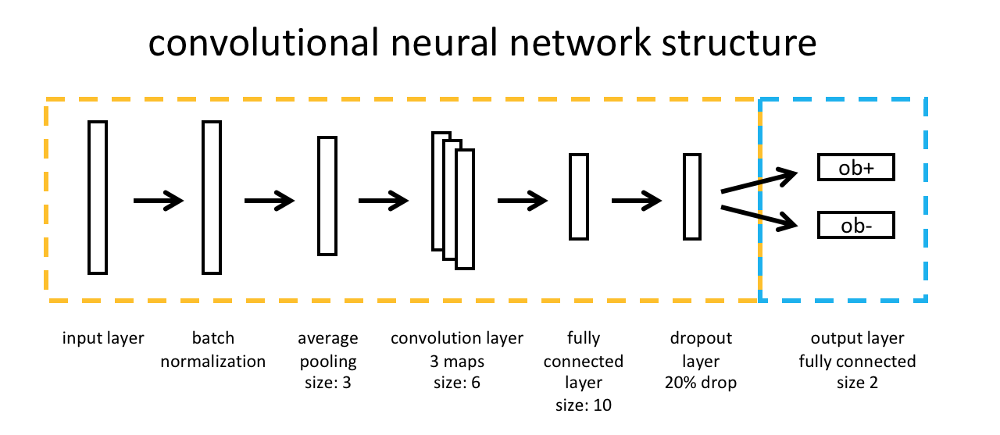

# cnn_ic_weight_pred
a convolutional neural network to predict the future weight gain of mice from indirect calorimetric data
[please ask for data]

---
## overview of experiment

---

---
### normalization layer helps to distinguish between different mouse strains

